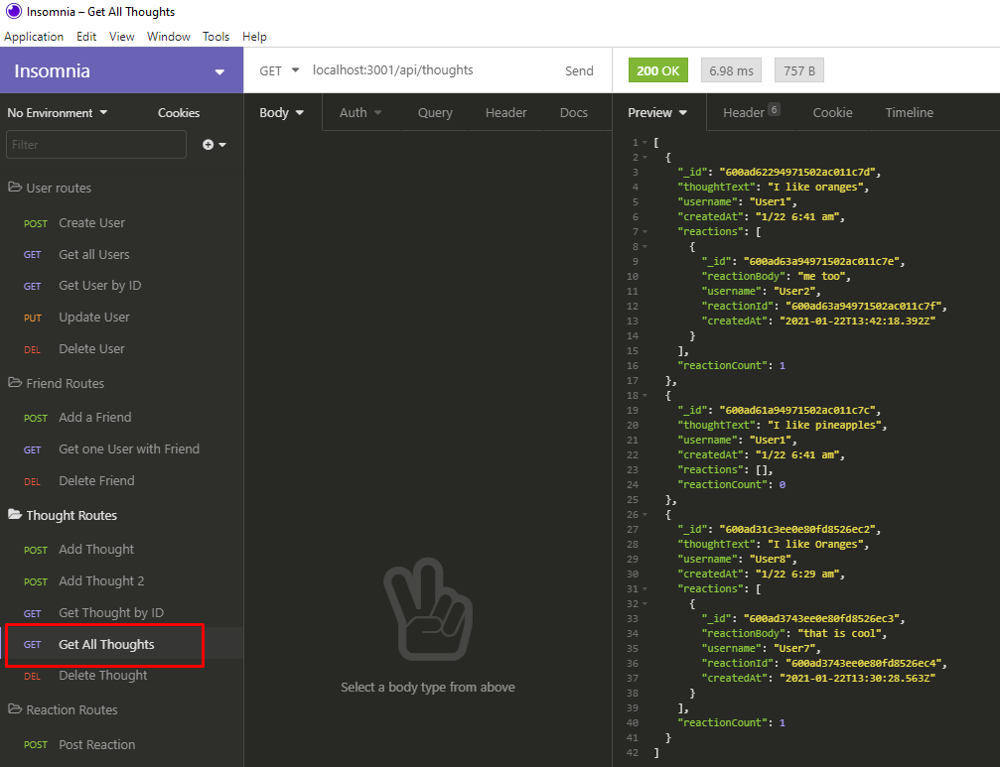

# Social Media API

## About this Project
This project was built with MongoDB using an express server. In this application you can do basic CRUD operations for Users and Thoughts and create and delete a reaction (response). You can see a demo video on the link below.

## Tech Used

- MongoDB
- Express.js
- Node.js
- Moment.js

## Installation & Usage
Clone this repo and then in your terminal type `npm install` to install all of the needed dependences. After which in your terminal type `npm start` to launch the application. You can test this application either using Insomnia or Postman or any API testing software of your choice. 

## Images and Demo
[YouTube Demo](https://youtu.be/VNg_lNKexxA)

This is an example of creating an user

This is an example of getting all users

This is an example of getting all thoughts

